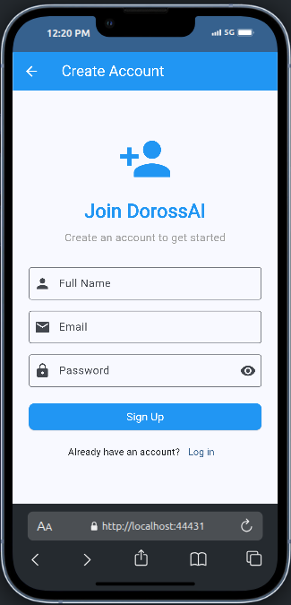
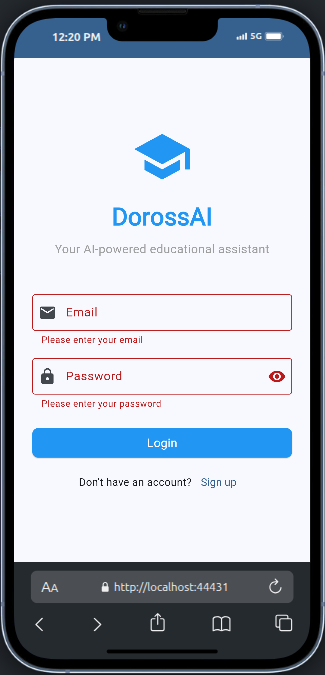
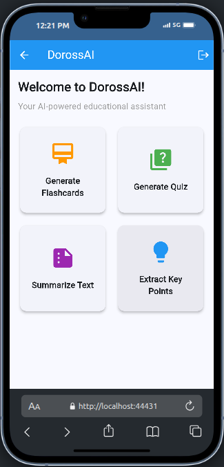
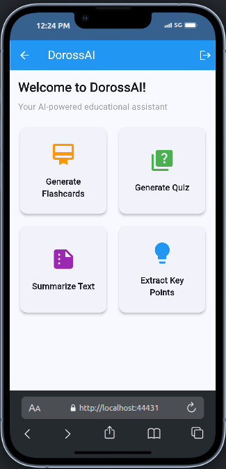
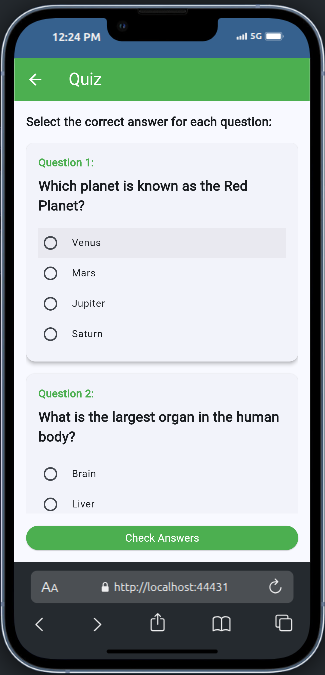
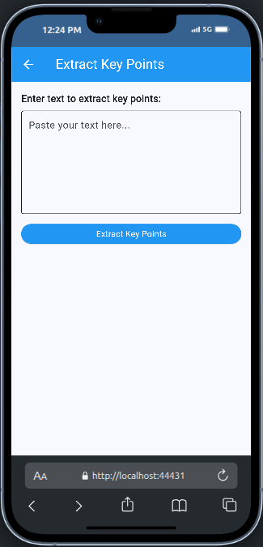

# DorossAI: AI-Powered Educational Assistant

## Project Report

### 1. Introduction

DorossAI is an innovative mobile application designed to revolutionize the way students learn and study. Leveraging artificial intelligence, the application provides a suite of tools that help students better understand, memorize, and test their knowledge on various subjects. This project was developed as part of my academic coursework to demonstrate the practical application of mobile development skills and the integration of AI concepts in educational technology.

### 2. Project Overview

#### 2.1 Problem Statement

Traditional studying methods often lack engagement and personalization, making it difficult for students to effectively absorb and retain information. Students frequently struggle with:
- Identifying key information in lengthy texts
- Creating effective study materials
- Testing their knowledge in a meaningful way
- Summarizing complex concepts

DorossAI addresses these challenges by providing AI-powered tools that streamline the studying process and make learning more efficient and engaging.

#### 2.2 Objectives

The primary objectives of this project were to:
1. Create an intuitive mobile application that enhances the studying experience
2. Implement AI-powered features for text summarization and knowledge extraction
3. Provide interactive learning tools like flashcards and quizzes
4. Design a clean, modern user interface that prioritizes usability
5. Develop a scalable architecture that can accommodate future enhancements

### 3. Application Architecture

#### 3.1 Technology Stack

DorossAI is built using the following technologies:

- **Flutter Framework**: For cross-platform mobile development
- **Dart Programming Language**: The primary language used with Flutter
- **Material Design**: For consistent and modern UI components
- **State Management**: Utilizing StatefulWidget for local state management
- **Navigation**: Flutter's built-in navigation system with named routes

#### 3.2 Application Structure

The application follows a modular architecture with clear separation of concerns:

```
lib/
├── main.dart           # Application entry point and route configuration
├── screens/            # UI screens for different features
│   ├── login_screen.dart
│   ├── signup_screen.dart
│   ├── home_screen.dart
│   ├── summarization_screen.dart
│   ├── key_points_screen.dart
│   ├── flashcard_screen.dart
│   └── quiz_screen.dart
```

#### 3.3 Design Patterns

- **Widget Composition**: Breaking down complex UIs into smaller, reusable widgets
- **Stateful/Stateless Pattern**: Using StatefulWidget for screens that manage state and StatelessWidget for presentational components
- **Builder Pattern**: Utilizing builder methods to construct complex UI elements
- **Dependency Injection**: Passing dependencies through constructors

### 4. Features and Implementation

#### 4.1 Authentication System

The application includes a complete authentication flow with:
- Login screen with email and password validation
- Sign-up functionality for new users
- Form validation to ensure data integrity
- Secure password handling with visibility toggle

**Implementation Details:**
- Custom form validation logic for email format and password strength
- Responsive design that adapts to different screen sizes
- Error handling with user-friendly messages

#### 4.2 Text Summarization

This feature allows users to input lengthy text and receive a concise summary of the key information.

**Implementation Details:**
- Text input area with multi-line support
- Processing indicator during summarization
- Formatted output display with proper styling
- Error handling for empty inputs

#### 4.3 Key Points Extraction

Users can extract important points from text, helping them identify the most critical information.

**Implementation Details:**
- Similar interface to the summarization feature for consistency
- Bulleted list presentation of key points
- Clear visual distinction between input and output sections

#### 4.4 Flashcard System

A comprehensive flashcard system that allows users to:
- Create custom flashcards with questions and answers
- Categorize flashcards by subject
- Filter and search through flashcards
- Flip cards to reveal answers
- Delete unwanted flashcards

**Implementation Details:**
- Advanced animations for card flipping using Matrix4 transformations
- Category filtering with dropdown and chip selection
- Search functionality with real-time filtering
- Swipe-to-delete gesture with confirmation dialog
- Custom card design with front/back distinction

#### 4.5 Quiz Generation

An interactive quiz system that:
- Presents multiple-choice questions
- Tracks user responses
- Provides immediate feedback on answers
- Shows final score and correct answers

**Implementation Details:**
- Radio button selection for answer choices
- Score calculation logic
- Detailed results view with correct/incorrect indicators
- Option to retry the quiz

### 5. User Interface

The application features a clean, intuitive user interface designed with the following principles:

- **Consistency**: Maintaining consistent color schemes, typography, and component styles across screens
- **Accessibility**: Ensuring adequate contrast, touch target sizes, and readable text
- **Responsiveness**: Adapting to different screen sizes and orientations
- **Visual Hierarchy**: Using size, color, and spacing to guide user attention
- **Feedback**: Providing clear feedback for user actions through animations and messages

### 6. Screenshots and Descriptions


*Login Screen: The entry point of the application featuring email and password fields with validation, along with a link to sign up for new users.*


*Home Screen: The main dashboard displaying the four core features of the application in a grid layout with distinctive icons and colors.*


*Flashcard Screen: Interactive flashcards with flip animation, category filtering, and search functionality to help users organize and review their study materials.*


*Quiz Screen: Multiple-choice quiz interface with clear question presentation and answer selection using radio buttons.*


*Summarization Screen: Text input area where users can paste content to be summarized, with a clean output display for the generated summary.*


*Key Points Screen: Similar to the summarization screen, this interface extracts and displays key points from text in an easy-to-read bulleted format.*

### 7. Conclusion

DorossAI demonstrates how mobile technology and artificial intelligence can be combined to create powerful educational tools. The application successfully addresses common studying challenges by providing intuitive, AI-powered features that help students learn more effectively.

Through this project, I've applied and strengthened my skills in:
- Mobile application development with Flutter
- User interface design and implementation
- State management in complex applications
- Animation and interactive elements
- Form handling and validation

This is a UI for an API I have developed in the cadre of a project in ENSET Mohammedia. Here is the link to it: 
https://github.com/AbderrahimeEl/doross-ai
